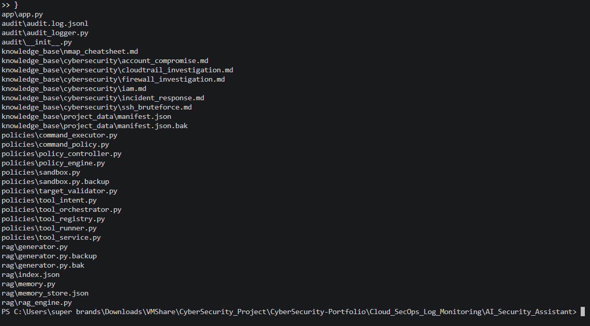
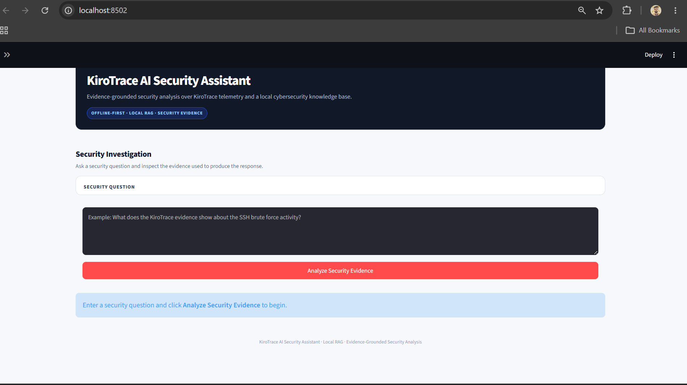
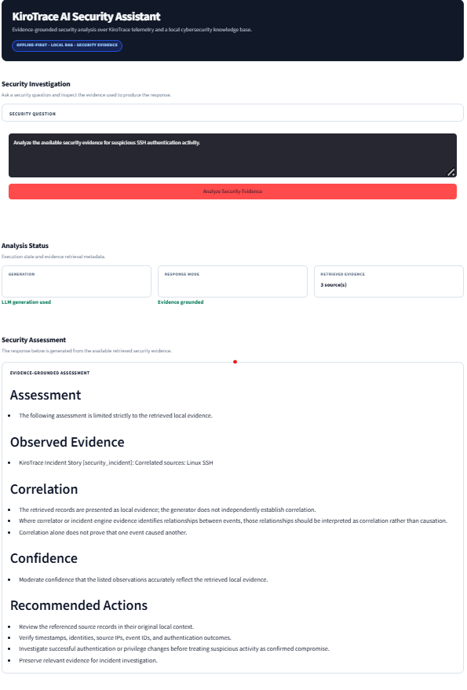
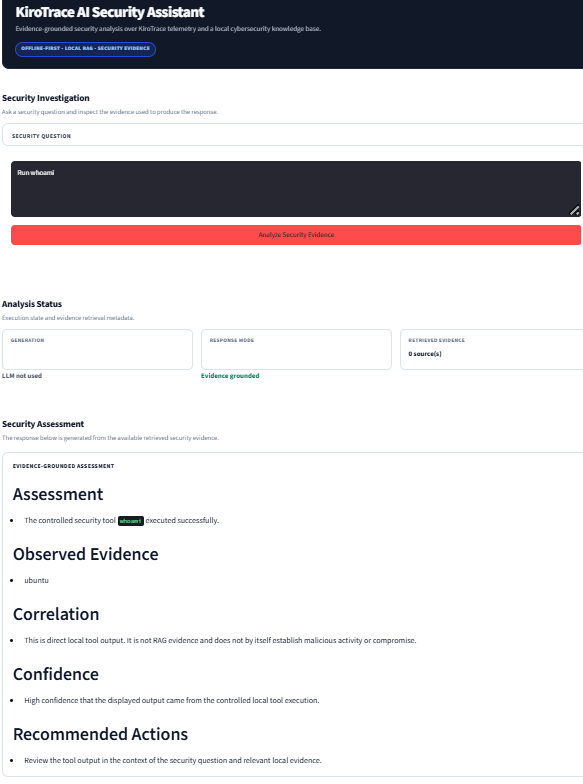
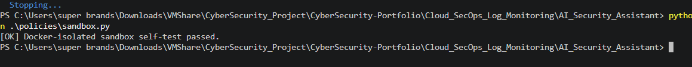
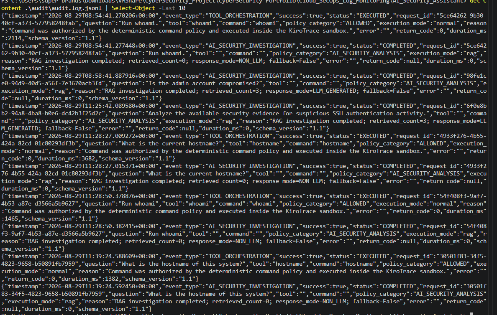

# KiroTrace — Cloud SecOps Log Monitoring & AI Security Assistant

**KiroTrace** is an offline-first Security Operations (SecOps) monitoring and AI-assisted investigation platform built with Python and Streamlit.

The project combines **local security telemetry, deterministic detection rules, evidence correlation, local Retrieval-Augmented Generation (RAG), controlled security tools, Docker-isolated sandbox execution, audit logging, and session/memory management** into a single security investigation workflow.

KiroTrace is designed as an educational and portfolio-grade security platform demonstrating how security automation and evidence-grounded AI can support practical **SOC, Cloud Security, Security Operations, and GRC-oriented workflows** without relying on external cloud APIs or enterprise SIEM infrastructure.

---

## Project Overview

Modern security operations generate large amounts of authentication, firewall, cloud, and system telemetry. Manually reviewing this data is time-consuming and makes consistent investigation difficult.

KiroTrace addresses this problem by providing a local security analysis pipeline that can:

* Parse security logs into a unified structure
* Detect suspicious activity using deterministic rules
* Correlate related security events
* Generate structured security findings
* Retrieve relevant local cybersecurity knowledge
* Retrieve local KiroTrace security evidence
* Generate evidence-grounded security assessments
* Execute a limited set of controlled security tools
* Run selected operations inside a Docker-isolated sandbox
* Record assistant and tool activity through JSONL audit logging
* Maintain contextual conversation memory
* Present investigation results through a Streamlit interface

The system follows an **evidence-first approach**: AI-generated conclusions are grounded in locally retrieved security evidence rather than being treated as authoritative by default.

---

## Core Objectives

KiroTrace was developed around the following objectives:

* Build an offline-first security monitoring workflow
* Demonstrate practical SOC investigation concepts
* Normalize heterogeneous security telemetry
* Detect suspicious authentication and network activity
* Correlate security events into meaningful incidents
* Combine local RAG with security telemetry
* Prevent unsupported AI security claims
* Separate project evidence from conversational memory
* Control security tool execution through policy enforcement
* Isolate sandbox operations from the host environment
* Maintain an auditable record of assistant and tool activity
* Provide a professional security investigation interface

---

## Key Features

### Security Monitoring

* Local security log ingestion
* CloudTrail-style event parsing
* Linux SSH authentication log parsing
* Firewall event parsing
* Unified JSON security event schema
* Event normalization
* Duplicate event handling
* Local telemetry analysis

### Detection & Correlation

* Deterministic security detection rules
* SSH brute-force detection
* Suspicious authentication activity detection
* Firewall security event detection
* Event correlation
* Incident-oriented analysis
* Security severity classification

### Local RAG

* Local cybersecurity knowledge base
* Local KiroTrace telemetry retrieval
* Evidence-grounded generation
* Retrieval metadata
* Evidence attribution
* Controlled context size
* Local Ollama LLM integration
* Local embedding model integration
* Deterministic fallback behavior

### AI Security Assistant

* Natural-language security investigation
* Security question intent detection
* Evidence-based assessment
* Observed evidence reporting
* Correlation analysis
* Confidence assessment
* Recommended actions
* Structured response validation

### Controlled Security Tools

The assistant does not receive unrestricted shell access.

Tool execution is controlled through a policy and orchestration layer.

Currently supported controlled operations include:

* `whoami`
* `hostname`

The architecture separates:

```text
User Request
     │
     ▼
Intent Detection
     │
     ▼
Policy Controller
     │
     ▼
Tool Orchestrator
     │
     ▼
Controlled Tool Runner
     │
     ▼
Audit Logger
```

Dangerous or unsupported shell-control requests are rejected rather than executed.

### Docker-Isolated Sandbox

KiroTrace includes a Docker-based sandbox mechanism for controlled execution.

The sandbox is designed to provide:

* Execution isolation
* Restricted command execution
* Container-based separation
* Controlled input/output handling
* Reduced host exposure
* Self-test validation

The sandbox is intentionally limited and is not intended to replace a production enterprise sandbox or EDR environment.

### Audit Logging

Assistant and tool activity is recorded in JSONL format:

```text
audit/
└── audit.log.jsonl
```

The audit layer provides a persistent record of relevant execution events for investigation and demonstration purposes.

Example inspection command:

```powershell
Get-Content .\audit\audit.log.jsonl | Select-Object -Last 10
```

This allows individual audit events to be inspected directly from the local project environment.

### Session & Memory Management

KiroTrace maintains contextual memory separately from security evidence.

This distinction is intentional:

```text
Conversation Memory
        │
        └── Context only

Security Evidence
        │
        └── Authoritative local telemetry
```

Memory is therefore not automatically treated as project evidence.

---

# Architecture

```text
                         ┌──────────────────────────┐
                         │      Streamlit UI        │
                         │   KiroTrace Assistant    │
                         └────────────┬─────────────┘
                                      │
                                      ▼
                         ┌──────────────────────────┐
                         │   Security Question      │
                         │     Intent Detection     │
                         └────────────┬─────────────┘
                                      │
                       ┌──────────────┴──────────────┐
                       │                             │
                       ▼                             ▼
             ┌──────────────────┐         ┌──────────────────┐
             │   Local RAG       │         │  Tool Policy     │
             │    Retrieval      │         │   & Orchestrator │
             └────────┬─────────┘         └────────┬─────────┘
                      │                            │
                      ▼                            ▼
             ┌──────────────────┐         ┌──────────────────┐
             │ Knowledge Base   │         │ Controlled Tools │
             │ + KiroTrace      │         │ whoami/hostname  │
             │    Evidence      │         └────────┬─────────┘
             └────────┬─────────┘                  │
                      │                            ▼
                      │                   ┌──────────────────┐
                      │                   │ Docker Sandbox   │
                      │                   └────────┬─────────┘
                      │                            │
                      └────────────┬───────────────┘
                                   ▼
                         ┌──────────────────────────┐
                         │ Evidence-Grounded        │
                         │ Security Analysis        │
                         └────────────┬─────────────┘
                                      │
                                      ▼
                         ┌──────────────────────────┐
                         │ Output Validation        │
                         │ + Confidence             │
                         │ + Evidence Attribution   │
                         └────────────┬─────────────┘
                                      │
                                      ▼
                         ┌──────────────────────────┐
                         │ Audit Logging             │
                         │ JSONL Event Recording     │
                         └──────────────────────────┘
```

---

# Security Analysis Pipeline

KiroTrace follows a structured investigation workflow:

```text
1. Security Question
        │
        ▼
2. Question Intent Detection
        │
        ▼
3. Local RAG Retrieval
        │
        ├── Cybersecurity Knowledge Base
        │
        └── KiroTrace Security Evidence
        │
        ▼
4. Controlled Tool Evaluation
        │
        ▼
5. Evidence-Grounded Generation
        │
        ▼
6. Output Validation
        │
        ▼
7. Security Assessment
        │
        ├── Assessment
        ├── Observed Evidence
        ├── Correlation
        ├── Confidence
        └── Recommended Actions
        │
        ▼
8. Audit Logging
```

---

# Evidence-Grounded AI

A major design principle of KiroTrace is that the AI assistant should distinguish between:

* Retrieved security evidence
* Local cybersecurity knowledge
* Controlled tool output
* Conversation memory
* General security reasoning

The assistant therefore avoids treating unsupported assumptions as confirmed security incidents.

For example, tool output such as:

```text
hostname
553c66c1e545
```

does not automatically indicate compromise.

Instead, the system can report that the output came directly from the controlled tool and avoid claiming malicious activity without supporting evidence.

This provides a more defensible security-analysis workflow than unrestricted generative responses.

---

# Standard Security Response Format

Security answers are structured using five required sections:

```text
## Assessment

## Observed Evidence

## Correlation

## Confidence

## Recommended Actions
```

### Assessment

Provides the security conclusion supported by available evidence.

### Observed Evidence

Lists the evidence retrieved or produced during the investigation.

### Correlation

Explains relationships between events or clarifies when evidence does not establish a security conclusion.

### Confidence

Communicates the confidence level supported by the available evidence.

### Recommended Actions

Provides practical next steps based on the observed situation.

---

# Local RAG Architecture

KiroTrace uses a local RAG architecture instead of depending on external AI APIs.

```text
Cybersecurity Knowledge Base
             │
             ▼
      Local Embeddings
             │
             ▼
       Vector Retrieval
             │
             ▼
       Relevant Context
             │
             ├───────────────┐
             │               │
             ▼               ▼
    Knowledge Evidence   KiroTrace Evidence
             │               │
             └───────┬───────┘
                     ▼
              Local LLM
                     │
                     ▼
          Evidence-Grounded Answer
```

The local AI stack uses:

* Ollama
* `phi3:mini`
* `nomic-embed-text`
* Local vector memory
* Local cybersecurity knowledge
* Local security telemetry

No external LLM API is required for the core workflow.

---

# Security Tool Control

Security tools are intentionally separated from the RAG generation pipeline.

```text
                    User Request
                         │
                         ▼
                  Intent Detection
                         │
                         ▼
                  Policy Evaluation
                         │
             ┌───────────┴───────────┐
             │                       │
             ▼                       ▼
       Tool Required            No Tool Required
             │                       │
             ▼                       ▼
       Tool Validation         Local RAG Analysis
             │
             ▼
       Controlled Runner
             │
             ▼
       Tool Execution
             │
             ▼
       Audit Logging
```

This separation reduces the risk of allowing generated text to directly control arbitrary system commands.

---

# Sandbox Environment

The sandbox uses Docker to provide an isolated execution environment.

The self-test can be executed with:

```powershell
python .\policies\sandbox.py
```

Expected result:

```text
[OK] Docker-isolated sandbox self-test passed.
```

The sandbox is intended to demonstrate controlled execution isolation as part of the security architecture.

---

# Audit Logging

KiroTrace records assistant and security-tool activity in JSONL format.

Audit log location:

```text
audit/
└── audit.log.jsonl
```

To inspect recent events:

```powershell
Get-Content .\audit\audit.log.jsonl | Select-Object -Last 10
```

The JSONL log provides evidence of execution activity and supports auditability of the assistant workflow.

---

# Project Structure

```text
Cloud_SecOps_Log_Monitoring/
│
└── AI_Security_Assistant/
    │
    ├── app/
    │   └── app.py
    │
    ├── audit/
    │   ├── audit_logger.py
    │   └── audit.log.jsonl
    │
    ├── knowledge_base/
    │
    ├── policies/
    │   ├── policy_controller.py
    │   ├── tool_intent.py
    │   ├── tool_orchestrator.py
    │   ├── tool_runner.py
    │   ├── tool_service.py
    │   └── sandbox.py
    │
    ├── rag/
    │   ├── generator.py
    │   ├── memory.py
    │   └── memory_store.json
    │
    ├── screenshots/
    │   ├── 01-project-structure.png
    │   ├── 02-main-dashboard.png
    │   ├── 03-security-analysis.png
    │   ├── 04-tool-execution.png
    │   ├── 05-sandbox-execution.png
    │   └── 06-audit-logging.png
    │
    ├── README.md
    └── ...
```

---

# Screenshots

The following screenshots document the main implementation and execution workflow.

## 1. Project Structure

The project structure screenshot demonstrates the organization of the KiroTrace application, including the application, RAG, policy, audit, knowledge-base, and screenshot components.



---

## 2. Main Dashboard

The main dashboard demonstrates the Streamlit-based KiroTrace AI Security Assistant interface and the overall security investigation workflow.



---

## 3. Security Analysis

The security analysis screenshot demonstrates an evidence-grounded security investigation and the structured response generated by the assistant.



---

## 4. Controlled Tool Execution

The tool execution screenshot demonstrates controlled security-tool execution through the KiroTrace policy and orchestration layer.



---

## 5. Docker-Isolated Sandbox

The sandbox screenshot demonstrates the Docker-isolated execution environment and sandbox self-test.



---

## 6. Audit Logging

The audit logging screenshot demonstrates actual JSONL audit events generated by assistant/tool activity.



---

# Technologies Used

## Programming

* Python 3
* Streamlit

## AI / RAG

* Ollama
* `phi3:mini`
* `nomic-embed-text`
* Local embeddings
* Retrieval-Augmented Generation
* Vector memory

## Security

* Security log analysis
* Authentication monitoring
* Firewall telemetry
* Security event correlation
* Detection engineering
* Security investigation
* Evidence attribution
* Security tool control
* Sandbox isolation
* Audit logging

## Infrastructure

* Docker
* PowerShell
* Windows development environment
* Local-first architecture

## Data Formats

* JSON
* JSONL
* LOG
* Markdown

---

# Installation

## 1. Clone the Portfolio Repository

```bash
git clone https://github.com/Saif2246/CyberSecurity-Portfolio.git
```

## 2. Navigate to the Project

```powershell
cd CyberSecurity-Portfolio\Cloud_SecOps_Log_Monitoring\AI_Security_Assistant
```

## 3. Verify the Project Structure

```powershell
Get-ChildItem
```

The project should contain directories such as:

```text
app
audit
knowledge_base
policies
rag
screenshots
```

---

# Local AI Requirements

KiroTrace uses Ollama for local model execution.

The configured architecture uses:

```text
LLM:
phi3:mini

Embedding:
nomic-embed-text
```

Ollama should be running locally before using AI-assisted RAG functionality.

The configured local endpoint is:

```text
http://localhost:11434
```

---

# Running the Application

From the project root:

```powershell
streamlit run .\app\app.py
```

The application opens the KiroTrace security assistant interface.

The user can then submit security investigation questions and inspect:

* Analysis status
* Generation mode
* Response mode
* Retrieved evidence
* Security assessment
* Evidence attribution
* Confidence
* Recommended actions

---

# Sandbox Self-Test

Run:

```powershell
python .\policies\sandbox.py
```

Expected output:

```text
[OK] Docker-isolated sandbox self-test passed.
```

---

# Memory Self-Test

The local vector memory implementation can be tested with:

```powershell
python -m rag.memory
```

A successful self-test should report:

```text
[OK] Vector memory self-test passed.
```

The memory subsystem is contextual and is intentionally kept separate from project security evidence.

---

# Audit Log Verification

After performing assistant or controlled-tool activity, inspect the latest audit records:

```powershell
Get-Content .\audit\audit.log.jsonl | Select-Object -Last 10
```

This provides a direct way to verify that relevant execution events were recorded.

---

# Security Design Principles

KiroTrace follows several security-oriented design principles.

### 1. Evidence Before Conclusions

Security claims should be supported by available evidence.

### 2. Least Privilege

The assistant does not receive unrestricted system-level command execution.

### 3. Tool Separation

Tool execution is separated from the RAG generation layer.

### 4. Controlled Execution

Tool requests pass through intent detection and policy enforcement.

### 5. Isolation

Sandbox operations use Docker-based isolation.

### 6. Auditability

Assistant and tool activity is recorded through JSONL audit logging.

### 7. Local-First Processing

Core security analysis and AI functionality operate locally.

### 8. Memory Separation

Conversation memory is contextual and should not automatically be treated as security evidence.

---

# Security Limitations

KiroTrace is a **portfolio and educational security platform**, not a production enterprise SIEM.

It intentionally does not attempt to provide:

* Enterprise-scale log ingestion
* High-availability infrastructure
* Distributed storage
* Full EDR functionality
* Production-grade threat intelligence
* Automated incident response
* Continuous cloud log streaming
* Enterprise IAM integration
* Production secrets management
* Large-scale multi-tenant security monitoring

The controlled tools are deliberately limited to reduce unnecessary system exposure.

---

# Real-World Security Problem

Security teams frequently need to answer questions such as:

* What happened on the system?
* Was suspicious authentication activity detected?
* Which events are related?
* What evidence supports the conclusion?
* Did a controlled security tool execute?
* What actions should an analyst take next?
* Can the investigation activity be audited?

Traditional log inspection provides raw events but does not necessarily provide a unified investigation workflow.

KiroTrace combines:

```text
Telemetry
   +
Detection
   +
Correlation
   +
RAG
   +
Controlled Tools
   +
Sandbox Isolation
   +
Audit Logging
   =
Security Investigation Workflow
```

This demonstrates how local AI can assist security analysis while maintaining explicit boundaries around evidence and system execution.

---

# Example Investigation Workflow

A typical investigation can follow:

```text
Security Question
       │
       ▼
Intent Classification
       │
       ▼
Retrieve Local Evidence
       │
       ▼
Retrieve Cybersecurity Knowledge
       │
       ▼
Determine Whether a Tool Is Required
       │
       ▼
Apply Security Policy
       │
       ▼
Execute Controlled Tool / Sandbox
       │
       ▼
Record Audit Event
       │
       ▼
Correlate Evidence
       │
       ▼
Generate Structured Assessment
       │
       ▼
Display Evidence & Recommendations
```

---

# Project Outcomes

The project demonstrates practical implementation of:

* Local Security Operations monitoring
* Security log normalization
* Detection engineering
* Event correlation
* Evidence-grounded AI
* Retrieval-Augmented Generation
* Local LLM integration
* Embedding-based retrieval
* Controlled security-tool execution
* Security policy enforcement
* Docker sandbox isolation
* Audit logging
* Contextual memory management
* Streamlit security interfaces
* Security evidence attribution

---

# Future Improvements

Potential future improvements include:

* CloudTrail ingestion from live sources
* Azure activity log support
* AWS security telemetry integration
* Microsoft Entra ID event analysis
* Syslog ingestion
* Real-time log streaming
* Expanded security detection rules
* MITRE ATT&CK technique mapping
* NIST control mapping
* CIS benchmark mapping
* IOC enrichment
* Threat-intelligence integration
* Incident timeline visualization
* Role-based access control
* Persistent investigation cases
* Production-grade sandbox policies
* Enterprise SIEM integration
* Automated alert prioritization
* Security metrics and dashboards
* PDF investigation reports

---

# Author

**Saif Ali**

BS Information Technology Student
Aspiring Cloud Security & GRC Professional
University of Layyah

**GitHub:**
https://github.com/Saif2246/CyberSecurity-Portfolio

**LinkedIn:**
https://www.linkedin.com/in/saif-ali-a22230409/

---

# Disclaimer

This project was developed for educational, research, portfolio, and authorized cybersecurity purposes.

The security telemetry and test scenarios used by the project are intended for controlled environments.

The tools and sandbox functionality should only be used on systems and environments for which the user has explicit authorization.

The author is not responsible for unauthorized use, misuse, or damage resulting from this project.

---

# Acknowledgements

KiroTrace was developed as a practical cybersecurity project to demonstrate the integration of:

* Security Operations
* Cloud Security concepts
* Local AI
* Retrieval-Augmented Generation
* Security telemetry analysis
* Detection engineering
* Security automation
* Tool policy enforcement
* Sandbox isolation
* Auditability
* Evidence-grounded security analysis

The project focuses on demonstrating that AI-assisted security analysis can be designed around **local evidence, controlled execution, explicit security boundaries, and auditable workflows** rather than unrestricted automation.

