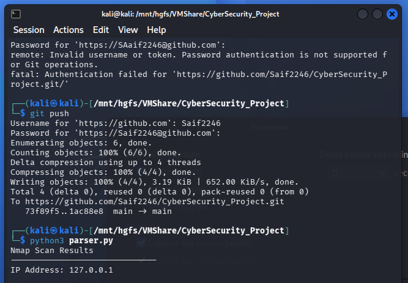
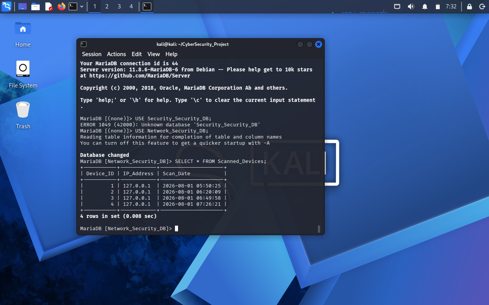
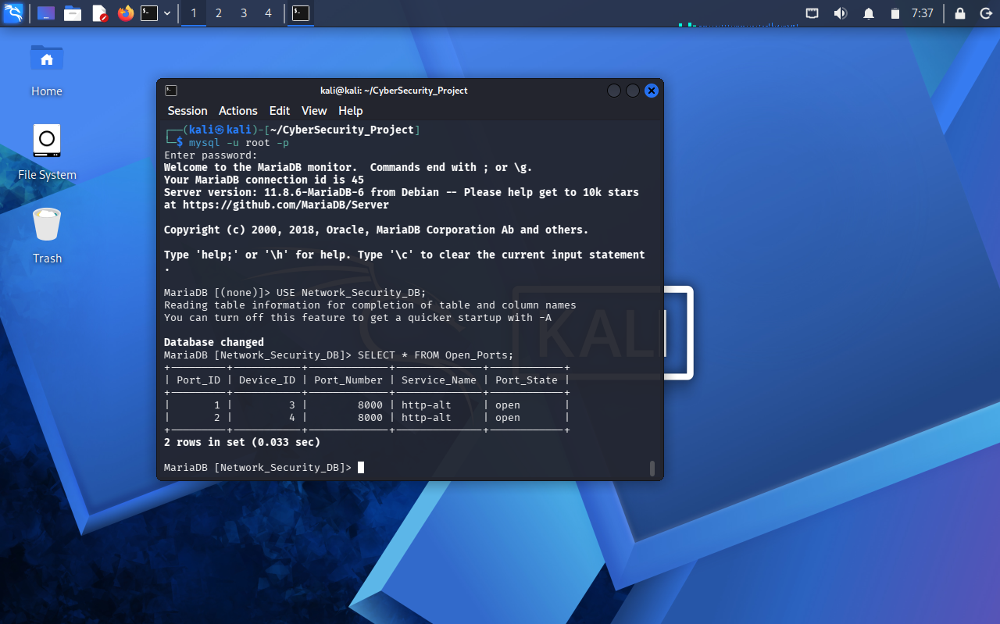

# Network Reconnaissance & Database Analyzer

## Project Overview

Network Reconnaissance & Database Analyzer is a Python-based cybersecurity tool designed to process Nmap XML scan results, extract network information, identify open ports and services, and store security data in a MariaDB database for analysis.

This project demonstrates practical concepts of network reconnaissance, XML parsing, database integration, and cybersecurity automation.

---

## Features

- Nmap XML Result Parsing
- Network Information Extraction
- Open Port Identification
- Service Detection
- MariaDB Database Integration
- Automated Security Data Storage
- Network Scan Analysis
- Security Report Processing

---

## Technologies Used

- **Programming Language:** Python 3
- **Operating System:** Kali Linux
- **Security Tool:** Nmap
- **Database:** MariaDB

**Python Libraries:**

- XML Parser
- MySQL Connector
- File Handling

---

## Project Structure

```text
Project_1_Network_Reconnaissance_Database_Analyzer

├── parser.py
├── scan_result.xml
├── README.md
├── mariadb_open_ports_table.png
├── mariadb_Scanned_devices_table.png
├── nmap-xml-parser-output.png
└── Parser_execution_terminal_output.png
```

## Installation

Clone the repository:
```bash
git clone <repository-url>
```
Navigate to the project directory:

```bash
cd Project_1_Network_Reconnaissance_Database_Analyzer
```

## Usage
Run the parser:
```bash
python3 parser.py
```
The script processes Nmap XML scan results, extracts security-related information, and stores the analyzed data into MariaDB.
---

## Database Integration

The project integrates Python with MariaDB to store extracted network information.

The database contains:

- Scanned Devices
- IP Addresses
- Open Ports
- Running Services
- Network Scan Results
  
  ```
  
## Screenshots

### Nmap XML Parser Output



---

### Parser Execution Terminal Output


---

### MariaDB Scanned Devices Table



---

### MariaDB Open Ports Table



---
## Learning Outcomes

Through this project, I learned:

- Network reconnaissance concepts
- Nmap scanning workflow
- XML data parsing using Python
- Database connectivity with Python
- Security data analysis
- Cybersecurity automation fundamentals
## Future Improvements

- Multiple target scanning support
- Web-based security dashboard
- Vulnerability risk scoring
- JSON report generation
- Cloud database integration
- Automated security alerts


## Author

Saif Ali

BS Information Technology Student

Aspiring Cloud Security & GRC Professional

---

## Disclaimer

This tool is developed for educational purposes and authorized security testing only.
