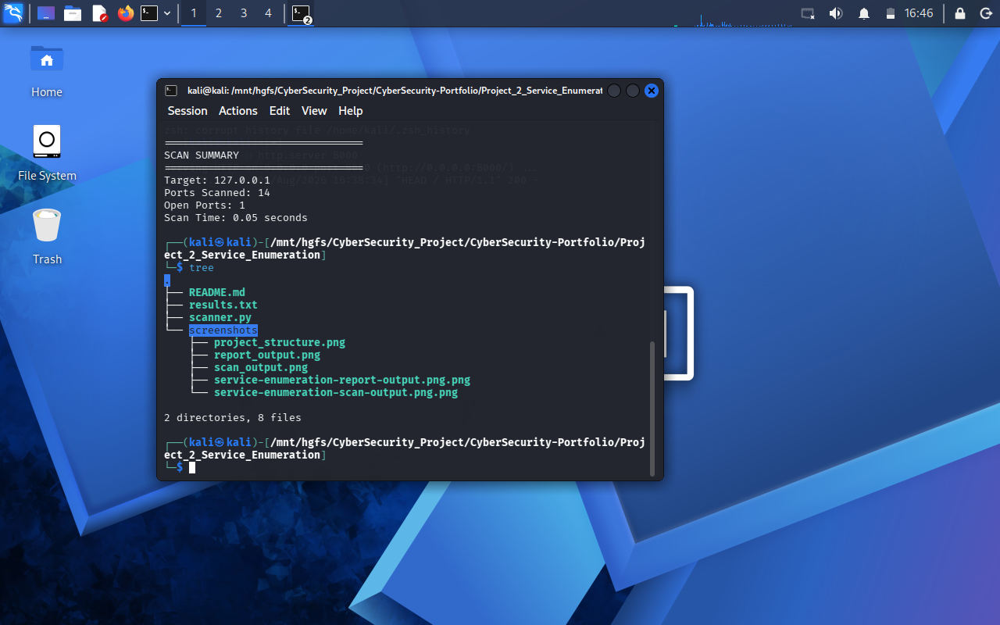
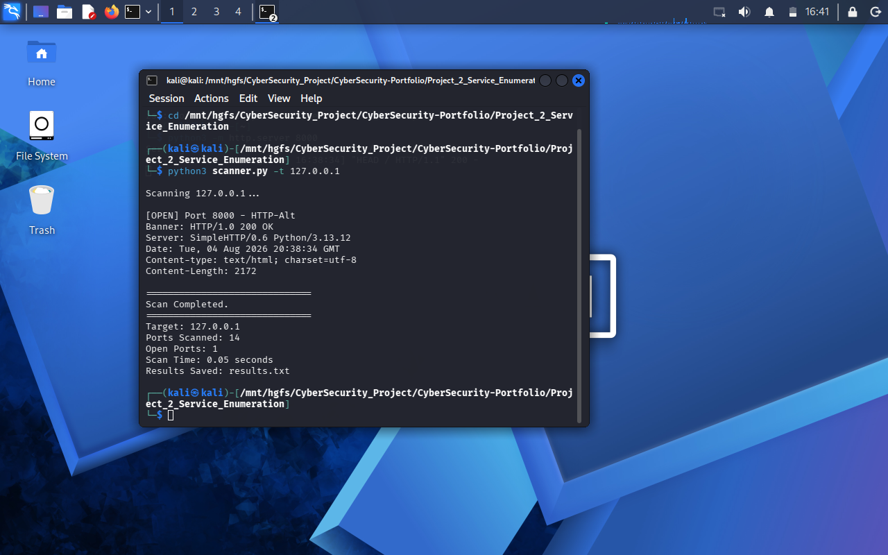
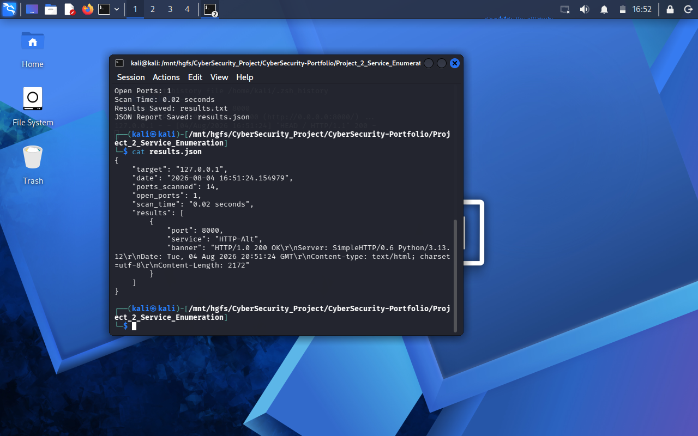
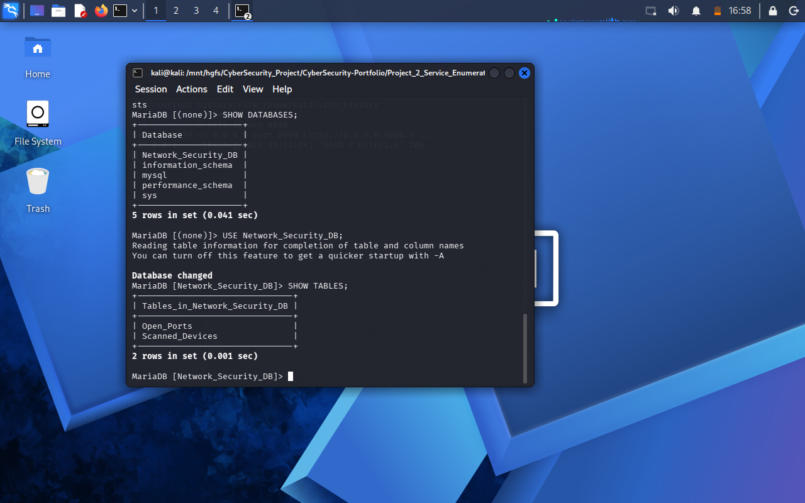
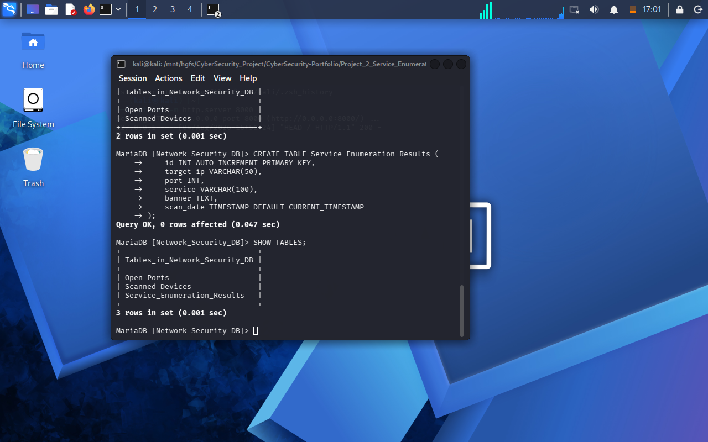
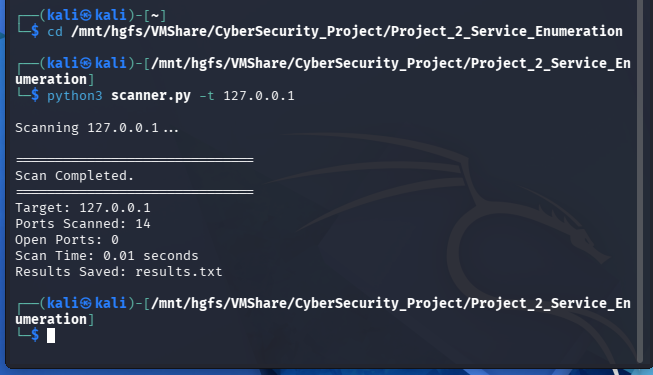
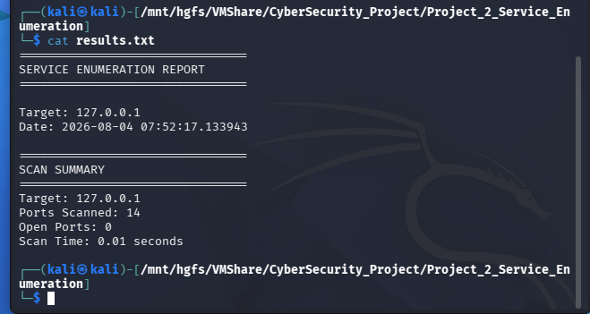
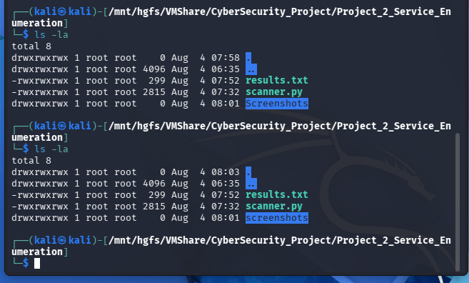

# Network Service Enumeration Tool

## Project Overview

Network Service Enumeration Tool is a Python-based security utility designed to scan TCP ports, identify running services, capture service banners, and generate a detailed scan report.

This project demonstrates practical concepts of networking, socket programming, multithreading, and basic security assessment.

---

## Features


- High-Speed Multi-threaded TCP Port Scanning
- Common Service Enumeration
- Open Port Detection
- HTTP Banner Grabbing
- Command-Line Target Selection (CLI)
- Timeout & Exception Handling
- Thread-Safe Scanning using Locks
- Automated TXT Report Generation
- Structured JSON Report Generation
- MariaDB Database Storage
- Scan Statistics & Performance Measurement
- Real-Time Scan Summary
- Clean and Modular Python Architecture

---

## Technologies Used

### Programming Language
- Python 3

### Operating System
- Kali Linux

### Database
- MariaDB

### Python Libraries
- socket
- threading
- argparse
- json
- mysql.connector
- time
- datetime

### Networking Concepts
- TCP Socket Programming
- Port Scanning
- Service Enumeration
- Banner Grabbing
- Multi-threading

---

---

## Project Workflow

```text
User Input (Target IP)
        │
        ▼
Load Common TCP Ports
        │
        ▼
Multi-threaded TCP Port Scanning
        │
        ▼
Open Port Detection
        │
        ▼
Service Identification
        │
        ▼
Banner Grabbing
        │
        ▼
Generate TXT Report
        │
        ▼
Generate JSON Report
        │
        ▼
Store Results in MariaDB
        │
        ▼
Display Scan Summary
```

## Project Structure

```text
Project_2_Service_Enumeration/
│
├── scanner.py
├── results.txt
├── results.json
├── README.md
│
└── screenshots/
    ├── mariadb-service-enumeration-results.png
    ├── mariadb-service-enumeration-table.png
    ├── mariadb-existing-tables.png
    ├── service-enumeration-json-report.png
    ├── project-structure.png
    ├── service-enumeration-report-output.png
    ├── service-enumeration-scan-output.png
    ├── project_structure.png
    ├── report_output.png
    └── scan_output.png
```

## Installation

### 1. Clone the repository

```bash
git clone https://github.com/Saif2246/CyberSecurity-Portfolio.git
```

### 2. Navigate to the project directory

```bash
cd CyberSecurity-Portfolio/Project_2_Service_Enumeration
```

### 3. Install the required dependency

```bash
pip install mysql-connector-python
```

## Usage

Run the scanner using the following command:

```bash
python3 scanner.py -t <target-ip>
```

### Example

```bash
python3 scanner.py -t 127.0.0.1
```

## Sample Output

```text
Scanning 127.0.0.1...

[OPEN] Port 8000 - HTTP-Alt

Banner:
HTTP/1.0 200 OK
Server: SimpleHTTP/0.6 Python/3.13.12

==============================
Scan Completed.
==============================
Target: 127.0.0.1
Ports Scanned: 14
Open Ports: 1
Scan Time: 0.02 seconds
Results Saved: results.txt
```
## Report Generation

The scanner automatically generates multiple output formats after every successful scan.

### TXT Report

```text
results.txt
```

Contains:

- Target IP Address
- Open Ports
- Detected Services
- Service Banners
- Scan Summary
- Scan Duration

### JSON Report

```text
results.json
```

Contains:

- Target Information
- Scan Date & Time
- Open Ports
- Service Information
- Banner Information
- Scan Statistics

### MariaDB Database

The scanner also stores scan results in the **Network_Security_DB** database.

Stored Information:

- Target IP Address
- Port Number
- Service Name
- Service Banner
- Scan Timestamp

## Screenshots

### 1. Project Structure



---

### 2. Service Enumeration Scan Output



---

### 3. Service Enumeration Report


---

### 4. JSON Report



---

### 5. Existing MariaDB Tables



---

### 6. Service Enumeration Database Table


---

### 7. MariaDB Stored Results



---

### 8. Additional Scan Output



---

### 9. Additional Report Output



---

### 10. Additional Project Structure




## Learning Outcomes

Through this project, I gained hands-on experience in:

- TCP Socket Programming
- Multi-threaded Port Scanning
- Service Enumeration Techniques
- Banner Grabbing
- Python Thread Synchronization
- Exception & Timeout Handling
- Command-Line Interface (CLI) Development
- TXT Report Generation
- JSON Report Generation
- MariaDB Database Integration
- Security Report Generation
- Practical Network Security Assessment
## Future Improvements

Future versions of this project may include:

- Custom Port Range Scanning
- UDP Port Scanning
- Multi-Target Scanning
- Service Version Detection
- Operating System (OS) Detection
- Vulnerability Assessment Integration
- Export Reports in CSV and PDF Formats
- Graphical User Interface (GUI)
- Cloud Asset Enumeration
- Integration with SIEM Platforms

## Skills Demonstrated

This project demonstrates practical experience in the following areas:

### Programming
- Python Programming
- Modular Code Development
- Command-Line Interface (CLI) Development

### Networking
- TCP Socket Programming
- TCP Port Scanning
- Service Enumeration
- Open Port Detection
- Banner Grabbing

### Cybersecurity
- Network Reconnaissance
- Basic Security Assessment
- Service Discovery
- Network Service Analysis

### Database
- MariaDB
- SQL Queries
- Database Integration
- Data Storage and Retrieval

### Software Development
- Multi-threading
- Thread Synchronization using Locks
- Exception Handling
- Timeout Handling
- JSON Processing
- TXT Report Generation
- JSON Report Generation
- Performance Measurement
- Scan Statistics Generation

## Author

**Saif Ali**

- BS Information Technology Student
- Aspiring Cloud Security & GRC Professional
- University of Layyah
- GitHub: https://github.com/Saif2246
- LinkedIn:www.linkedin.com/in/saif-ali-a22230409

## Disclaimer

This project was developed for educational and ethical cybersecurity purposes only.

It is intended for use in authorized environments where you have explicit permission to perform network scanning. The author is not responsible for any misuse of this tool.
## Acknowledgements

This project was developed as part of my cybersecurity learning journey to strengthen practical skills in networking, service enumeration, multithreading, reporting, and database integration.