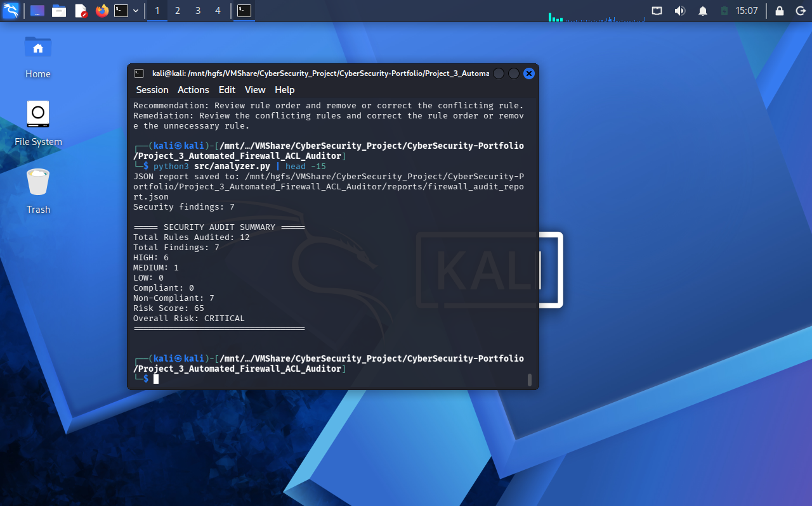
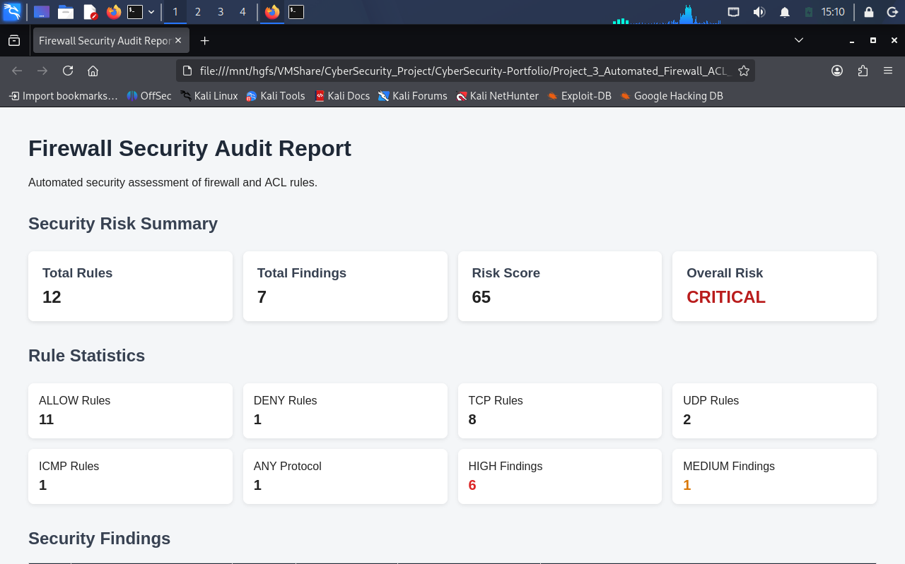

# Automated Firewall & ACL Auditor

## Project Overview

Automated Firewall & ACL Auditor is a Python-based security auditing tool designed to analyze firewall and Access Control List (ACL) rules, identify security weaknesses, evaluate compliance, calculate an overall risk score, and generate structured security audit reports.

The project simulates a practical enterprise firewall rule auditing workflow by automatically detecting overly permissive access, insecure services, duplicate rules, and conflicting firewall policies.

This project demonstrates practical concepts in **Network Security, Firewall Auditing, Least Privilege, Security Controls, Compliance Assessment, Risk Scoring, and Automated Security Reporting**.

---

## Features

* Automated Firewall Rule Analysis
* ACL Security Assessment
* Broad Source Access Detection
* Unrestricted Protocol & Port Detection
* Insecure Service Detection
* Duplicate Firewall Rule Detection
* Conflicting Firewall Rule Detection
* Security Severity Classification
* Compliance Control Mapping
* Remediation Recommendations
* Automated Risk Scoring
* Overall Risk Classification
* Firewall Rule Statistics
* JSON Security Report Generation
* Professional HTML Security Dashboard
* Modular Python Architecture
* Exception Handling
* Automated Report Storage

---

## Security Checks

The auditor currently performs the following security checks:

### 1. Broad Source Access

Detects firewall rules that allow traffic from any IPv4 source:

```text
0.0.0.0/0
```

**Severity:** HIGH

---

### 2. Unrestricted Protocol and Port Access

Detects rules that allow:

```text
Protocol: any
Port: any
```

**Severity:** HIGH

---

### 3. Insecure Services

Detects insecure services such as:

```text
FTP   → Port 21
Telnet → Port 23
```

**Severity:** HIGH

---

### 4. Duplicate Firewall Rules

Detects multiple rules containing the same traffic criteria and action.

**Severity:** MEDIUM

---

### 5. Conflicting Firewall Rules

Detects rules that match the same traffic but use different actions such as:

```text
ALLOW
DENY
```

**Severity:** HIGH

---

## Risk Assessment

The auditor assigns severity levels to identified findings:

| Severity | Description                                         |
| -------- | --------------------------------------------------- |
| HIGH     | Significant security weakness requiring attention   |
| MEDIUM   | Security or configuration weakness requiring review |
| LOW      | Minor security or configuration issue               |

The project also calculates an overall **Risk Score** and assigns an overall risk level.

Example:

```text
Total Findings: 7
HIGH: 6
MEDIUM: 1
LOW: 0

Risk Score: 65
Overall Risk: CRITICAL
```

---

## Compliance Mapping

Security findings are mapped to security controls and requirements.

Examples include:

| Finding                               | Control                        |
| ------------------------------------- | ------------------------------ |
| Broad Source Access                   | Network Access Control         |
| Unrestricted Protocol and Port Access | Least Privilege Network Access |
| Insecure Service                      | Secure Services                |
| Duplicate Firewall Rule               | Firewall Rule Management       |
| Conflicting Firewall Rule             | Firewall Rule Management       |

This allows the project to move beyond simple vulnerability detection toward a basic **GRC-oriented security assessment workflow**.

---

## Technologies Used

### Programming Language

* Python 3

### Operating System

* Kali Linux

### Data Format

* CSV
* JSON
* HTML

### Python Libraries

* pathlib
* csv
* json

### Security Concepts

* Firewall Security
* ACL Auditing
* Network Access Control
* Least Privilege
* Secure Services
* Rule Management
* Compliance Assessment
* Risk Scoring
* Security Remediation

---

## Project Workflow

```text
Firewall / ACL Rules
        │
        ▼
Read CSV Rule Dataset
        │
        ▼
Parse Firewall Rules
        │
        ▼
Run Security Checks
        │
        ├── Broad Source Access
        ├── Any Protocol / Port
        ├── Insecure Services
        ├── Duplicate Rules
        └── Conflicting Rules
        │
        ▼
Generate Security Findings
        │
        ▼
Map Findings to Controls
        │
        ▼
Generate Remediation Guidance
        │
        ▼
Calculate Risk Score
        │
        ▼
Generate Rule Statistics
        │
        ├── JSON Report
        │
        └── HTML Dashboard
```

---

## Project Structure

```text
Project_3_Automated_Firewall_ACL_Auditor/
│
├── data/
│   └── firewall_rules.csv
│
├── reports/
│   ├── firewall_audit_report.json
│   └── firewall_audit_report.html
│
├── screenshots/
│   ├── terminal-audit.png
│   └── html-dashboard.png
│
├── src/
│   ├── analyzer.py
│   ├── parser.py
│   ├── report_generator.py
│   └── html_report.py
│
├── firewall_rules.csv
└── README.md
```

---

## Installation

### 1. Clone the Repository

```bash
git clone https://github.com/Saif2246/CyberSecurity-Portfolio.git
```

### 2. Navigate to the Project

```bash
cd CyberSecurity-Portfolio/Project_3_Automated_Firewall_ACL_Auditor
```

### 3. Verify the Project Structure

```bash
ls -lh
```

---

## Usage

### Run the Security Auditor

```bash
python3 src/analyzer.py
```

The analyzer will:

* Parse the firewall rule dataset
* Audit all firewall rules
* Detect security findings
* Map findings to security controls
* Generate remediation recommendations
* Calculate the risk score
* Generate the JSON report
* Display the audit summary

---

## Sample Audit Output

```text
JSON report saved to:
reports/firewall_audit_report.json

Security findings: 7

===== SECURITY AUDIT SUMMARY =====
Total Rules Audited: 12
Total Findings: 7
HIGH: 6
MEDIUM: 1
LOW: 0
Compliant: 0
Non-Compliant: 7
Risk Score: 65
Overall Risk: CRITICAL
==================================

===== RULE STATISTICS =====
Total Rules: 12
ALLOW Rules: 11
DENY Rules: 1
TCP Rules: 8
UDP Rules: 2
ICMP Rules: 1
ANY Protocol Rules: 1
============================
```

---

## Generate HTML Security Dashboard

Run:

```bash
python3 src/html_report.py
```

Expected output:

```text
HTML report saved to:
reports/firewall_audit_report.html
```

Open the dashboard in Kali Linux:

```bash
xdg-open reports/firewall_audit_report.html
```

---

## JSON Report

The analyzer automatically generates:

```text
reports/firewall_audit_report.json
```

The report contains:

* Security summary
* Risk score
* Overall risk
* Firewall statistics
* Security findings
* Severity
* Compliance status
* Security controls
* Requirements
* Recommendations
* Remediation guidance

Example structure:

```json
{
    "summary": {
        "total_findings": 7,
        "high": 6,
        "medium": 1,
        "low": 0,
        "compliant": 0,
        "non_compliant": 7,
        "risk_score": 65,
        "overall_risk": "CRITICAL"
    },
    "statistics": {
        "total_rules": 12,
        "allow_rules": 11,
        "deny_rules": 1,
        "tcp_rules": 8,
        "udp_rules": 2,
        "icmp_rules": 1,
        "any_protocol_rules": 1
    },
    "findings": []
}
```

---

## View JSON Report

To inspect the generated report:

```bash
cat reports/firewall_audit_report.json
```

For a cleaner summary:

```bash
python3 -c "import json; r=json.load(open('reports/firewall_audit_report.json')); print(json.dumps({'summary': r['summary'], 'statistics': r['statistics']}, indent=4))"
```

---

## HTML Security Dashboard

The generated HTML dashboard provides a human-readable representation of the security assessment.

It displays:

* Total Rules
* Total Findings
* Risk Score
* Overall Risk
* Allow Rules
* Deny Rules
* TCP Rules
* UDP Rules
* ICMP Rules
* Any Protocol Rules
* High Findings
* Medium Findings
* Detailed Security Findings
* Compliance Status
* Security Controls
* Remediation Guidance

---

## Screenshots

### 1. Terminal Security Audit



The terminal output demonstrates the automated firewall analysis, risk score, rule statistics, security findings, compliance status, and remediation recommendations.

---

### 2. HTML Security Dashboard



The HTML dashboard provides a professional visual representation of the firewall security assessment and identified findings.

---

## Real-World Problem Solved

In real enterprise environments, firewalls and ACLs may contain hundreds or thousands of rules.

Manually reviewing these rules can be:

* Time-consuming
* Error-prone
* Difficult to maintain
* Difficult to audit consistently

This project addresses that problem by automatically analyzing firewall rules and identifying common security weaknesses.

For example, it can detect:

```text
0.0.0.0/0
```

which represents unrestricted IPv4 source access, or:

```text
protocol = any
port = any
```

which may provide unnecessarily broad network access.

The tool therefore helps security teams identify **overly permissive, insecure, duplicate, or conflicting firewall rules** before they become security risks.

---

## Example Findings

### Broad Source Access

```text
Rule 2: Broad Source Access
Severity: HIGH
Compliance: NON-COMPLIANT

Reason:
The rule allows traffic from any IPv4 source.

Remediation:
Replace 0.0.0.0/0 with an approved internal or administrative IP range.
```

### Insecure Service

```text
Rule 5: Insecure Service
Severity: HIGH
Compliance: NON-COMPLIANT

Reason:
Telnet is an insecure service that should not normally be exposed.

Remediation:
Disable the insecure service or replace it with a secure alternative such as SSH.
```

### Conflicting Rule

```text
Rule 9: Conflicting Firewall Rule
Severity: HIGH
Compliance: NON-COMPLIANT

Reason:
The rule conflicts with Rule 8 because both rules match
the same traffic but use different actions.

Remediation:
Review the conflicting rules and correct the rule order
or remove the unnecessary rule.
```

---

## Learning Outcomes

Through this project, I gained hands-on experience in:

* Firewall Rule Auditing
* ACL Security Analysis
* Network Access Control
* Least Privilege
* Security Control Mapping
* Compliance Assessment
* Risk Scoring
* Security Finding Classification
* Remediation Development
* JSON Report Generation
* HTML Report Generation
* Python Modular Development
* CSV Data Processing
* Exception Handling
* Security Automation

---

## Skills Demonstrated

### Cybersecurity

* Firewall Security
* ACL Auditing
* Network Security
* Security Assessment
* Security Controls
* Least Privilege
* Secure Service Analysis
* Security Remediation

### GRC

* Compliance Mapping
* Control Identification
* Requirement Mapping
* Risk Assessment
* Risk Scoring
* Non-Compliance Identification
* Audit Reporting

### Programming

* Python
* Modular Programming
* File Handling
* CSV Processing
* JSON Processing
* Exception Handling
* Automated Reporting

### Reporting

* Structured JSON Reports
* HTML Security Dashboards
* Security Finding Reports
* Risk Summaries
* Remediation Reports

---

## Future Improvements

Future versions of this project may include:

* Enterprise Firewall Configuration Parsing
* Cisco ACL Support
* AWS Security Group Auditing
* Azure Network Security Group Auditing
* Cloud Firewall Auditing
* Rule Shadowing Detection
* Unused Rule Detection
* Overlapping CIDR Detection
* Rule Expiration Detection
* CVSS-Based Risk Scoring
* NIST Control Mapping
* CIS Benchmark Mapping
* CSV/PDF Report Export
* Database Storage
* REST API Integration
* SIEM Integration
* Enterprise GRC Dashboard

---

## Author

**Saif Ali**

* BS Information Technology Student
* Aspiring Cloud Security & GRC Professional
* University of Layyah
* GitHub: [Saif2246](https://github.com/Saif2246)
* LinkedIn: [saif-ali-a22230409](https://www.linkedin.com/in/saif-ali-a22230409/)

---

## Disclaimer

This project was developed for **educational and ethical cybersecurity purposes only**.

The firewall rules used in this project are simulated/test data. The tool should only be used to audit systems, networks, firewalls, and ACLs that you own or have explicit authorization to assess.

The author is not responsible for unauthorized use or misuse of this project.

---

## Acknowledgements

This project was developed as part of my cybersecurity learning journey to strengthen practical skills in **network security, firewall auditing, security automation, compliance assessment, risk analysis, and GRC-oriented security reporting**.
